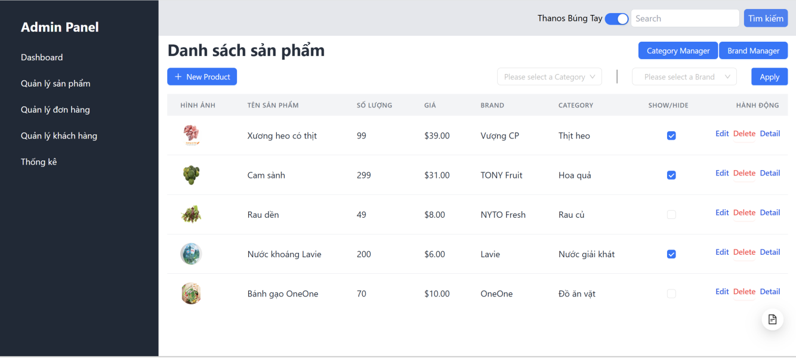
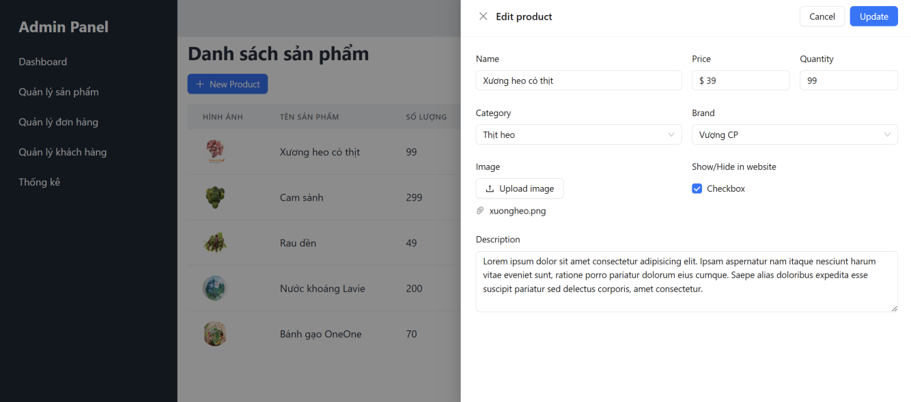
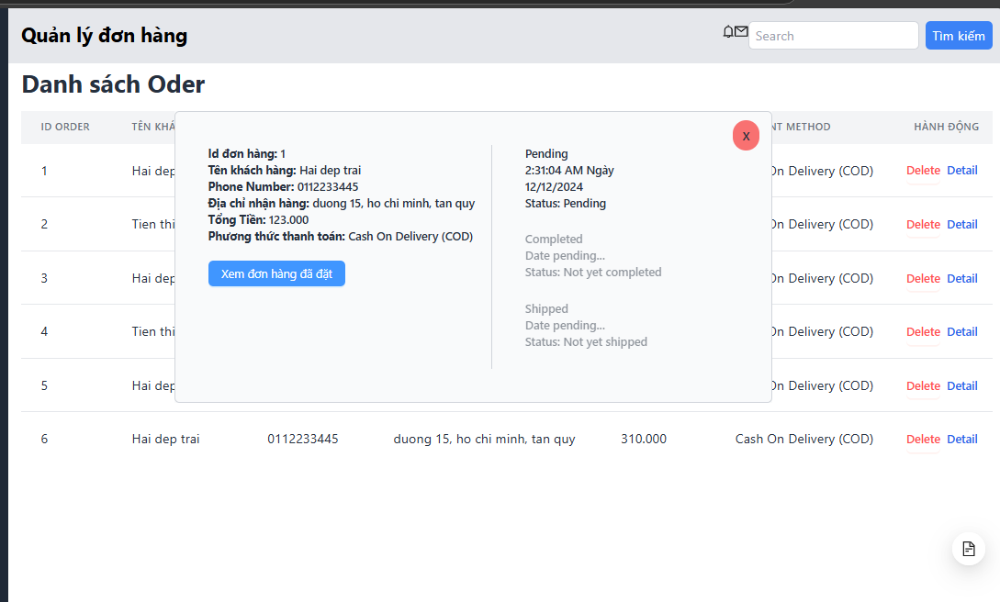
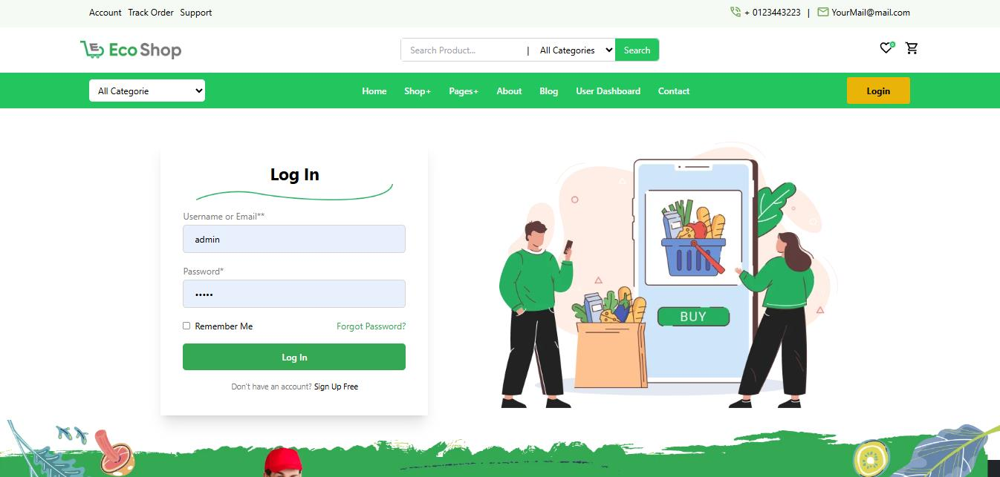
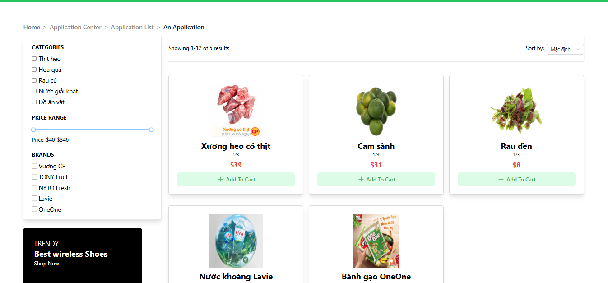
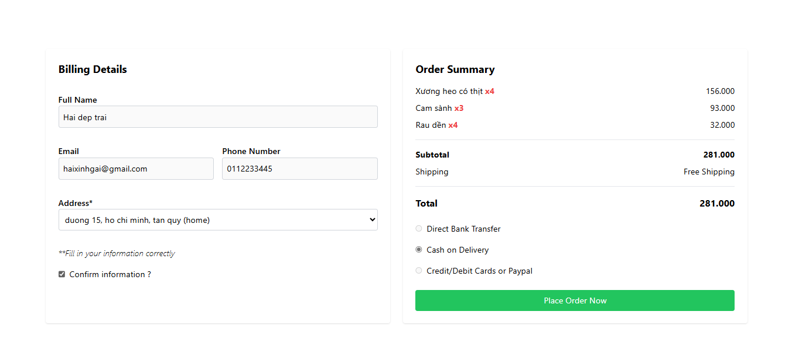

# Ministar: E-Commerce Platform
## License
Specify the license here (e.g., MIT, Apache 2.0).
For any further queries, feel free to reach out to the project maintainer.

## Project Overview
Ministar is a comprehensive e-commerce platform designed to simulate a fully functional online shopping system. The primary goal is to learn and familiarize with modern technologies, such as ASP.NET Core 7 and React, while implementing essential features required for a shopping website.

### Key Technologies
- **Backend**: C# ASP.NET Core 7, Onion Architecture
- **Frontend**: React, Javascript (TypeScript), Tailwind css, Ant design...
- **Database**: SQL Server, LINQ
- **Other Tools**: Visual Studio 2022, Node.js, VS Code, SublimeText 4, Git, Diagram.io, 

## Features
1. **User Management**
   - User registration, login, and role-based access control (Admin, Buyer, Supporter).
   - User profile management: address, contact information, tracking order.
2. **Product Management**
   - View, add, update, and delete products with images and categories, brand.
   - Support for product filtering and search.
3. **Shopping Cart**
   - Add, update, or remove items from the cart.
   - Calculate total prices dynamically.
4. **Order Management**
   - Create, view, and manage orders.
   - Admin functionalities for order tracking and status updates.
5. **Admin Features**
   - Manage users, products, and Order.
   - Monitor platform statistics and generate reports.

## Installation and Setup

### Prerequisites
- Visual Studio 2022
- Node.js (latest stable version)
- SQL Server
  
### Steps to Run the Project
1. **Clone the Repository**:
   ```bash
   git clone <repository-url>
   cd Ministar/main
   ```

2. **Backend Setup**:
   - Open the solution in Visual Studio.
   - Configure `appsettings.json` with your database connection string.
   - Run migrations to create the database:
     ```bash
     dotnet ef database update
     ```
   - Seed initial data into the database using `AppDbContext`.
   - Start the backend application:
     ```bash
     dotnet run
     ```

3. **Frontend Setup**:
   - Navigate to the frontend directory:
     ```bash
     cd Frontend
     ```
   - Install dependencies:
     ```bash
     npm install
     npm install vite
     ```
   - Run the development server:
     ```bash
     npm run dev
     ```

4. **Access Application**:
   - Backend: Available at `https://localhost:<5179>`
   - Frontend: Available at `http://localhost:8080`

## Project Architecture
Ministar employs the **Onion Architecture** for scalability and maintainability.

### Backend Structure
```plaintext
Domain
├── Entities
│   ├── Request
├── Interfaces
Infrastructure
├── Persistence
│   ├── Migrations
│   ├── Configuration
├── Repositories
│── AppDbContext.cs (includes seed data)
│── appsettings.json
Presentation
├── BackEndApi
│   ├── Controller
├── ViewModels
```

### Frontend Structure
The frontend follows a traditional React structure with components, services, and state management:
```plaintext
src
├── components
├── services
├── pages
├── assets
├── index.css
├── main.tsx
├── Router.tsx

```

## Database Schema
The following schema outlines the database structure:

### Tables and Relationships
- **Users**: Manages user information, linked with roles.
- **Roles**: Defines user roles (Admin, Buyer, Supporter).
- **Products**: Stores product details, linked with categories and brands.
- **Orders and Order_Items**: Handles orders and associated products.
- **Cart and Cart_Items**: Manages user shopping carts.
- **Addresses**: Stores user addresses.

#### Relationships
- `Users.RoleId` → `Roles.RoleId`
- `Orders.BuyerId` → `Users.UserId`
- `Orders.AddressId` → `Addresses.AddressId`
- `Products.CategoryId` → `Categories.CategoryId`
- `Products.BrandId` → `Brands.BrandId`
- `Carts.UserId` → `Users.UserId`
- `Cart_Items.CartId` → `Carts.CartId`
- `Cart_Items.ProductId` → `Products.ProductId`
- `Order_Items.OrderId` → `Orders.OrderId`
- `Order_Items.ProductId` → `Products.ProductId`

## API Documentation
- **Swagger**: Available at `https://localhost:<port>/swagger` for detailed API endpoints.

## Contribution
This project does not currently accept external contributions.

### System Interface Screenshots

## Admin Panel
Sample screenshots from the admin management interface:

| View 1 | View 2 | View 3 |
|--------|--------|--------|
|  |  |  |

## Home Page (User Side)
Main interfaces visible to customers visiting the website:

| View 1 | View 2 | View 3 |
|--------|--------|--------|
|  |  |  |

